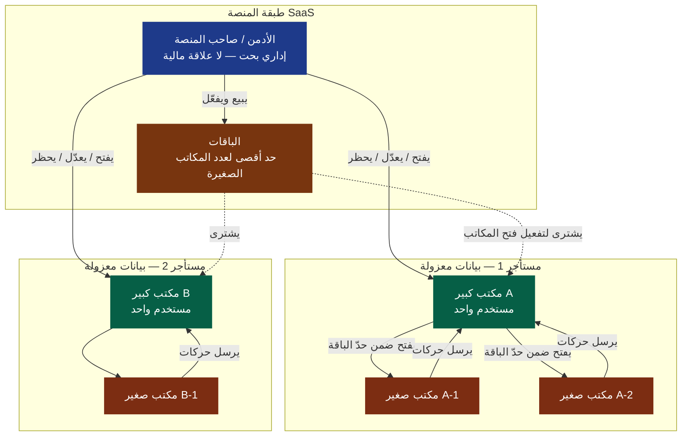
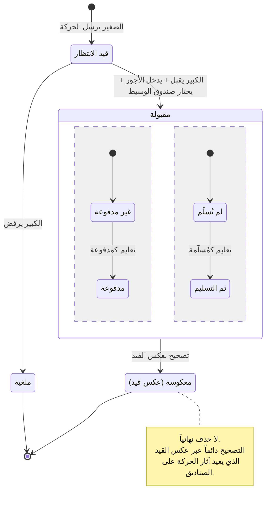
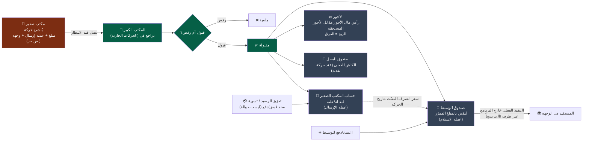
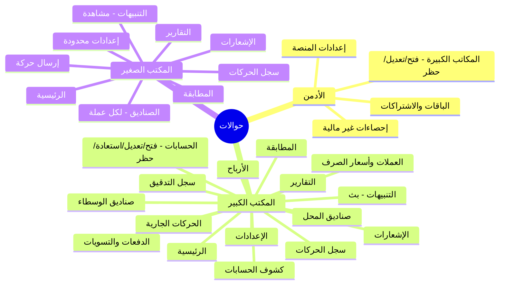
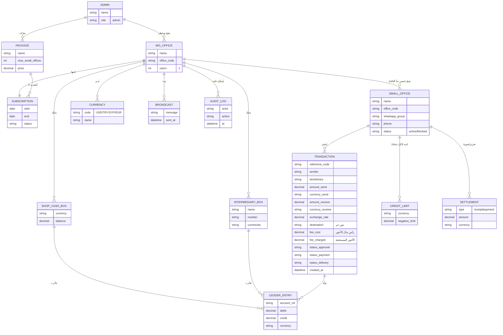
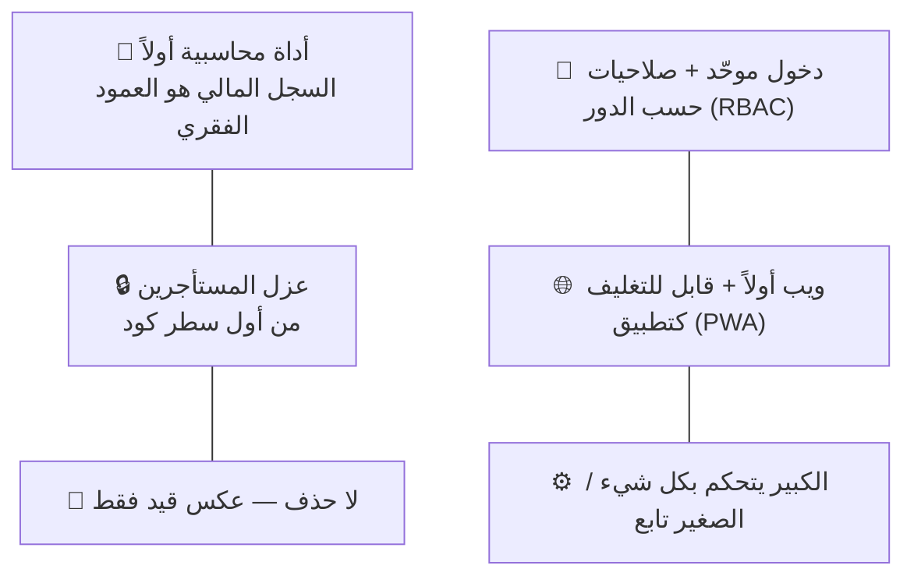

# مشروع حوالات — المخططات المعمارية (Architecture Diagrams)

> مخططات مرئية تلخّص كل ما سُجّل في `00-discovery-notes.md`.
> تُقرأ مع الدفتر، وتتحدّث معه كلما تغيّرت الرؤية.

---

## 1) الأدوار والهرمية والباقات (Roles · Tenancy · Subscriptions)

**ملاحظات:**
- كل **مكتب كبير = مستأجر (Tenant)** ببيانات معزولة تماماً.
- **الأدمن** لا يرى المال؛ يدير المكاتب الكبيرة والباقات فقط.
- **المكاتب الصغيرة مجانية** (لا دفع)، لكن عددها محكوم بباقة المكتب الكبير.
- **الفرد = المكتب الصغير** (نفس الكيان: مستخدم تابع لمكتب كبير).

---

## 2) دورة حياة الحركة (Transaction Lifecycle)

**الحالات الثلاث مستقلة عن بعضها:** القبول (انتظار/مقبولة/ملغية) · الدفع (مدفوعة/غير مدفوعة) · التسليم (مُسلَّمة/غير مُسلَّمة).

---

## 3) المسار المحاسبي لحركة واحدة (Money & Ledger Flow)

**القاعدة:** كل حركة مقبولة تولّد قيوداً متعددة (حساب الصغير + الأجور/الربح + صندوق الوسيط)، مربوطة بسعر الصرف عند اختلاف العملتين. الحد السالب لكل عملة يمنع الإرسال عند تجاوزه.

---

## 4) خريطة الأقسام حسب الدور (Navigation Map)

---

## 5) نموذج البيانات المبدئي (Entity Relationship — Draft)

> ⚠️ هذا النموذج **مبدئي (Draft)** لتوضيح الرؤية فقط — لا يُعتمد للبناء قبل مرحلة التصميم التقني ومراجعته معك.

---

## 6) المبادئ الحاكمة (Governing Principles)

