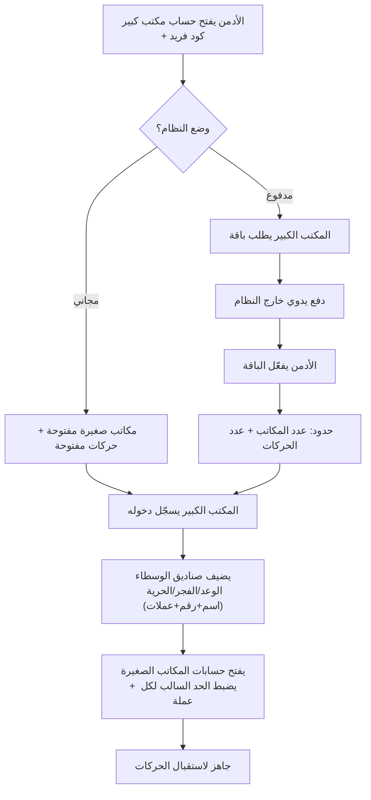
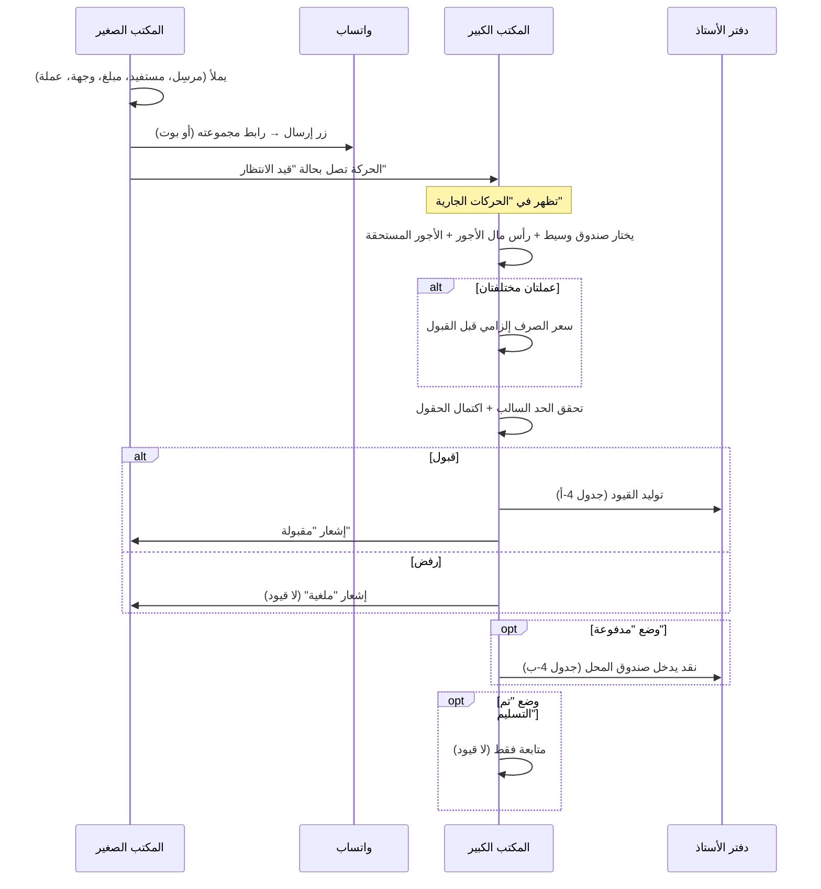
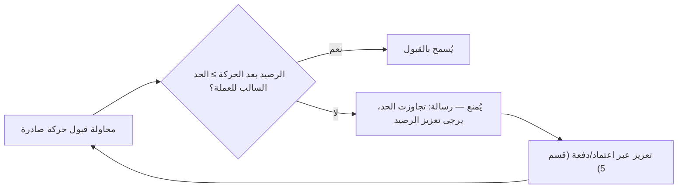
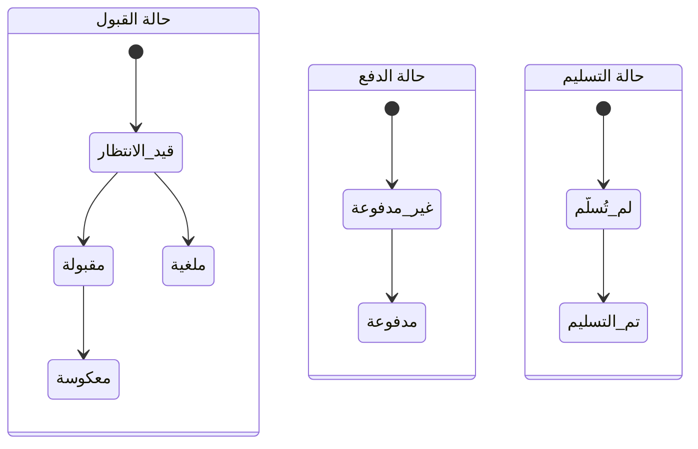

# مشروع حوالات — الدورة التشغيلية الكاملة (Operational Cycle)

> وثيقة رسمية تصف الدورة التشغيلية **كاملةً ومتسلسلةً**، بكل الحالات والأحوال،
> وما تولّده كل عملية من **قيود محاسبية متتابعة**.
> مصدرها: `00-discovery-notes.md` (20 جزءاً + 6 مشاهد). آخر تحديث: 2026-08-07.

---

## 0. اصطلاحات القيد (Sign Convention)

كل حساب/صندوق له **رصيد جارٍ** يزيد وينقص. نقرأ الأرصدة كالتالي:

| الكيان | رصيد سالب (−) يعني | رصيد موجب (+) يعني |
|---|---|---|
| **حساب مكتب صغير** (في دفاتر الكبير) | المكتب الصغير **عليه** (مدين لنا) | المكتب الصغير **له** (دائن علينا) |
| **صندوق وسيط** | **نحن عليه له** (نُدين للوسيط) | **لنا عنده** رصيد/إيداع |
| **صندوق المحل** (نقد) | — (لا يكون سالباً عملياً) | نقد فعلي موجود |

- كل عملية = **قيد مزدوج** (طرفان متساويان)، والنظام **محاسبي أولاً**.
- **لا حذف** لأي حركة إطلاقاً — التصحيح **فقط بعكس القيد (Reversal)**.
- **مثال مرجعي موحّد** يُستخدم في كل الجداول:
  - مبلغ الحوالة = **1000**
  - رأس مال الأجور (تكلفة الوسيط) = **10**
  - الأجور المستحقة (على المكتب الصغير) = **15**

---

## 1. الجهات الفاعلة (Actors)

| الدور | المستخدمون | العلاقة المالية |
|---|---|---|
| **الأدمن** (صاحب المنصة) | مستخدم إداري | ❌ لا علاقة مالية — يدير المكاتب الكبيرة والباقات فقط |
| **المكتب الكبير** (مستأجر) | مستخدم واحد | ✅ محور المحاسبة: يعالج الحركات، يدير الصناديق والأرصدة |
| **المكتب الصغير** (= الفرد) | مستخدم واحد تابع | ✅ يُنشئ الحركات ويتابع حسابه؛ لا يعدّل ولا يفتح حسابات |

**العزل:** كل مكتب كبير = مستأجر معزول تماماً. **لا تعامل بين المكاتب الكبيرة** (أُلغي).
كود المكتب الصغير مرتبط بكود مكتبه الكبير (مثل `BIG042-SML007`).

---

## 2. المرحلة التمهيدية (Setup Flow)

**قاعدة الترحيل (Grandfathering):** المكاتب المُنشأة في الوضع المجاني **لا تتأثر** عند تفعيل باقة أصغر؛ الحد يسري على **الجديد بعد التفعيل** فقط.

---

## 3. الدورة الكاملة لحركة (Transaction End-to-End)

---

## 4. القيود المتولّدة لكل فعل (Ledger Cascades)

### 4-أ. عند **قبول** الحركة (Approve)
**الشروط قبل الإتاحة:** كل الحقول المطلوبة مملوءة + سعر الصرف (إن اختلفت العملتان) + عدم تجاوز الحد السالب.

| الحساب | الأثر | القيمة (المثال) | التفسير |
|---|---|---|---|
| حساب المكتب الصغير | − (المبلغ + الأجور المستحقة) | **−1015** | أصبح عليه للكبير |
| صندوق الوسيط (الوعد) | − (المبلغ + رأس مال الأجور) | **−1010** | الكبير أصبح عليه للوسيط |
| ربح المكتب الكبير (مذكرة) | + (المستحقة − رأس المال) | **+5** | فرق الأجور |

**تحقق التوازن (من منظور الكبير):** +1015 (له على الصغير) − 1010 (عليه للوسيط) = **+5 = الربح** ✅
**أثر الرصيد:** صندوق الوسيط **ينقص** (سحبنا لتمرير الحركة)، وحساب الصغير **ينقص** (زاد ما عليه).

### 4-ب. عند وضع **"مدفوعة"** (Paid)
| الحساب | الأثر | القيمة | التفسير |
|---|---|---|---|
| صندوق المحل (نقد) | + (المبلغ + الأجور المستحقة) | **+1015** | استلمنا نقداً |
| حساب المكتب الصغير | + (المبلغ + الأجور المستحقة) | **+1015** | يُصفّى دَينه بالكامل → يعود إلى الصفر |

**النتيجة:** النقد يحلّ محلّ الذمة؛ حساب الصغير من هذه الحركة = 0، والنقد في المحل زاد.

### 4-ج. عند وضع **"تم التسليم"** (Delivered)
- **لا قيود محاسبية.** مجرد متابعة لحالة الحوالة (هل سُلِّمت للزبون). اختيارية.

### 4-د. عند **الرفض** (Reject)
- **لا قيود.** تنتقل الحركة مباشرة إلى "ملغية" في السجل. إشعار للمكتب الصغير.

### 4-هـ. عند **التعديل** بعد التنفيذ (Edit)
- يتم عبر **عكس القيد الأصلي** ثم **توليد قيد جديد** بالقيم المعدّلة.
- **ينعكس على الطرفين** (الصغير والكبير) ويظهر في سجل التدقيق.

### 4-و. عند **عكس القيد** (Reversal — بديل الحذف)
- يُنشأ قيد **معاكس تماماً** للقيد الأصلي يعيد كل الأرصدة المتأثرة إلى ما كانت عليه.
- الحركة الأصلية **تبقى** في السجل موسومة "معكوسة" (لا تُحذف).

---

## 5. عمليات الصناديق: اعتماد / سحب (Deposit / Withdraw)

تُجرى من قسم **صناديق الوسطاء**، وتُسجَّل **باسم مكتب صغير**. (مبلغ المثال = X)

### 5-أ. **اعتماد** (إيداع في صندوق وسيط)
| الحساب | الأثر | التفسير |
|---|---|---|
| صندوق الوسيط | **+X** | أودعنا مالاً فيه |
| حساب المكتب الصغير | **+X** (ينقص ما عليه) | هو من دفع لنا هذا الاعتماد |

### 5-ب. **سحب** (من صندوق وسيط)
| الحساب | الأثر | التفسير |
|---|---|---|
| صندوق الوسيط | **−X** | سحبنا منه |
| حساب المكتب الصغير | **−X** (يزيد ما عليه) | صُرف لصالحه |

**الاستخدام:** هذه هي آلية **التسويات وتعزيز الرصيد** فعلياً (لتجاوز الحد السالب مثلاً).

---

## 6. الحد السالب (Credit Limit Enforcement)

- الحد **لكل عملة على حدة**، يحدّده **المكتب الكبير**.
- عند تجاوزه → **يُمنع الإرسال/القبول** حتى يُعزَّز الرصيد.

---

## 7. المطابقة (Reconciliation)

- زر **"مطابقة"** لمكتب صغير: يجمع صافي عملياته لكل عملة → **ماذا له / ماذا عليه**.
- زر **"إرسال مطابقة"** (للواتساب).
- النظام يحفظ **تاريخ آخر مطابقة**، فلا يجلب أرقاماً قبله:
  - المطابقة الجديدة = **رصيد سابق (من آخر مطابقة) + حركات جديدة بعده**.
- **كشف دوري فقط — لا يُصفّر الحسابات** (قد تمرّ شهور بلا تسوية).
- التصفير الفعلي يتم عبر **الاعتماد/السحب/التسويات** (قسم 5)، لا عبر زر المطابقة.

---

## 8. ثنائية العملة وسعر الصرف (Dual-Currency)

- لكل حركة: **العملة المقبوضة** (من المرسِل) و**العملة المسلَّمة** (للمستفيد).
- **متطابقتان** → لا يظهر سعر الصرف؛ القيود كلها بعملة واحدة (كما في المثال المرجعي).
- **مختلفتان** → يظهر **سعر الصرف** و**يصبح إلزامياً قبل القبول**:
  - حساب المكتب الصغير يتحرك بـ**العملة المقبوضة** (ما جُمِع من المرسِل).
  - صندوق الوسيط يتحرك بـ**العملة المسلَّمة** (ما يُسلَّم في الوجهة).
  - الطرفان مربوطان بـ**سعر الصرف المثبّت بتاريخ الحركة** (لا يتغيّر لاحقاً).
- العملة قابلة للاختيار من **الصغير (عند الإرسال)** ومن **الكبير (عند المعالجة)**.

> 🔖 تفصيل تنفيذي بسيط للتأكيد لاحقاً: **بأي عملة تُحسب الأجور** في الحركة ثنائية العملة
> (المقبوضة أم المسلَّمة)؟ — يُحسم عند التصميم التقني.

---

## 9. آلات الحالات (State Machines)

**ثلاث حالات مستقلة لكل حركة:**

- **حالة القبول** تُنقل الحركة من "الحركات الجارية" إلى "سجل الحركات".
- **حالة الدفع** لها أثر محاسبي (قسم 4-ب). **حالة التسليم** متابعة فقط.

---

## 10. الجدول الشامل: كل فعل ← ما يولّده

| # | الفعل | الفاعل | القيود المتولّدة | الحالة الناتجة |
|---|---|---|---|---|
| 1 | إنشاء وإرسال حركة | صغير | لا شيء (بعد) | قيد الانتظار |
| 2 | قبول | كبير | صغير −(م+مستحقة)، وسيط −(م+رأس مال)، ربح +فرق | مقبولة |
| 3 | رفض | كبير | لا شيء | ملغية |
| 4 | وضع مدفوعة | كبير | محل +(م+مستحقة)، صغير +(م+مستحقة) | مدفوعة |
| 5 | وضع تم التسليم | كبير | لا شيء | مُسلَّمة |
| 6 | تعديل منفّذة | كبير | عكس الأصل + قيد جديد | معدّلة (على الطرفين) |
| 7 | عكس قيد | كبير | قيد معاكس تام | معكوسة |
| 8 | اعتماد | كبير | وسيط +X، صغير +X | تسوية |
| 9 | سحب | كبير | وسيط −X، صغير −X | تسوية |
| 10 | حركة الكبير لنفسه | كبير | كالبند 2 عبر حساب ذاتي | مقبولة |

---

## 11. الحالات الحدّية والاستثناءات (Edge Cases)

1. **تجاوز الحد السالب** → منع القبول حتى التعزيز (قسم 6).
2. **تجاوز حدّ الباقة** (عدد المكاتب/الحركات) في الوضع المدفوع → منع الإنشاء الجديد (مع الترحيل للقديم).
3. **محاولة تعديل من المكتب الصغير** → ممنوعة تماماً (حتى قيد الانتظار).
4. **حظر مكتب صغير** → لا يستطيع الدخول/الإرسال؛ حسابه وتاريخه محفوظان.
5. **رفض حركة** → لا قيود، تُؤرشف كملغية.
6. **عملتان مختلفتان بلا سعر صرف** → القبول محظور حتى إدخال السعر.
7. **الوسيط ينفّذ خارجياً** → النظام يسجّل فقط من أي صندوق خرجت؛ التسليم الفعلي مسؤولية بشرية خارج البرنامج.
8. **الأدمن** → لا يرى أي رقم مالي إطلاقاً (إحصاءات مجرّدة فقط).

---

## 12. المبادئ الحاكمة (تُطبَّق على كل ما سبق)

1. 🧮 **أداة محاسبية أولاً** — كل شاشة نافذة على دفتر الأستاذ.
2. 🔒 **عزل المستأجرين** من أول سطر.
3. 🚫 **لا حذف — عكس قيد فقط.**
4. 🔑 **دخول موحّد + صلاحيات حسب الدور (RBAC).**
5. 🌐 **ويب أولاً + قابل للتغليف (PWA).**
6. ⚙️ **الكبير يتحكم بكل شيء / الصغير تابع / الأدمن إداري بحت.**
