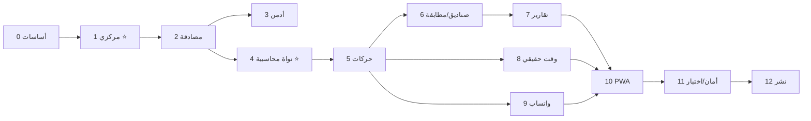

# مشروع حوالات — خطة البناء الكاملة (Build Plan)

> خطة تنفيذ من **أول لحظة إلى آخر لحظة**: من إعداد البيئة حتى النشر والتشغيل.
> مبنية على: `00-discovery-notes.md` + `01-architecture-diagrams.md` + `02-operational-cycle.md`.
> تاريخ: 2026-08-07.

---

## 0. الحزمة التقنية (Tech Stack)

| الطبقة | التقنية | السبب |
|---|---|---|
| **Backend** | **Django + Django REST Framework** | كما طُلب؛ ناضج، آمن، مثالي لنظام محاسبي |
| **قاعدة البيانات** | **PostgreSQL** | معاملات ACID، دقة أرقام (Decimal)، عزل مستأجرين، موثوقية مالية |
| **الوقت الحقيقي** | **Django Channels + WebSockets + Redis** | تحديث لحظي (حركات جديدة، أرصدة، إشعارات، بث) |
| **المهام الخلفية** | **Celery + Redis** | الإشعارات، تصدير PDF/Excel، بوت الواتساب، المطابقات |
| **المصادقة** | **JWT (SimpleJWT)** مع claims للدور والمستأجر | دخول موحّد + RBAC + عزل |
| **Frontend** | **Next.js (React) + TypeScript** | كما طُلب؛ SSR/PWA، تجربة قوية |
| **بيانات الواجهة** | **TanStack Query (React Query)** + عميل WebSocket | إدارة حالة الخادم + التحديث اللحظي |
| **التصميم المركزي** | **Design Tokens + طبقة ثيم مركزية** (RTL أولاً) | كل الألوان/الخطوط/الأحجام من مصدر واحد |
| **التصدير** | **WeasyPrint/ReportLab (PDF)** + **openpyxl (Excel)** | تقارير على جانب الخادم |
| **PWA** | Manifest + Service Worker | تثبيت كتطبيق أندرويد (تغليف) |
| **الحاويات** | **Docker + docker-compose** | بيئة موحّدة (postgres/redis/web/worker) |

> 🟡 **قرارات تحتاج تأكيدك** (في نهاية الملف، القسم 13) قبل كتابة أول سطر.

---

## 1. المبدأ الأول: نظام مركزي كامل منذ البداية (Centralization First)

> ⭐ **أهم مبدأ في هذه الخطة:** لا شيء "مبعثر". كل ثابت له **مصدر واحد** يُستهلك في كل مكان.
> إن أردنا تغيير لون أو خط أو قاعدة، نغيّره **في مكان واحد** فينعكس على كل الموقع.

### 1-أ. نظام التصميم المركزي (Design System)
ملف/طبقة **Design Tokens** واحدة تحوي:
- **الألوان** (Palette): أساسية، ثانوية، نجاح/خطأ/تحذير، خلفيات، حدود — لـ **الوضعين الفاتح والداكن**.
- **الخطوط** (Typography): عائلة الخط (عربي أولاً)، الأحجام (مقياس متدرّج)، الأوزان، ارتفاع السطر.
- **المسافات** (Spacing scale): 4/8/12/16... موحّدة.
- **الزوايا والظلال** (Radii & Shadows)، **نقاط الكسر** (Breakpoints)، **الطبقات** (z-index)، **الحركة** (Motion/transitions).
- **الاتجاه**: دعم **RTL** أصيل (عربي) مع إمكانية LTR لاحقاً.

### 1-ب. مكتبة المكوّنات المركزية (Component Library)
مكوّنات موحّدة تُبنى مرة وتُستخدم في كل مكان:
`Button · Input · Select · Table · Card · Modal · Badge · Toast · Tabs · Pagination · DatePicker · CurrencyInput · StatCard · EmptyState · Skeleton`
- كلها تقرأ من الـ Tokens — **لا ألوان/أحجام مكتوبة يدوياً داخل أي صفحة**.

### 1-ج. الثوابت المركزية (Central Config)
مصدر واحد لكل من: **الأدوار والصلاحيات (RBAC)** · **حالات الحركة** · **العملات** · **رسائل النظام** · **قوالب رسائل الواتساب** · **تنسيق الأرقام/العملات/التواريخ** · **الترجمة (i18n) عربي أولاً**.

### 1-د. طبقات مركزية في الـ Backend
- **نموذج أساسي** `TenantScopedModel` (كل جدول مالي يحمل `tenant_id` ويُفلتر تلقائياً).
- **Mixins** موحّدة: `TimeStamped`, `Auditable`, `SoftReversible` (لا حذف).
- **محرك القيود المزدوجة** (Ledger Engine) مركزي — كل عملية مالية تمرّ عبره.
- **عميل API مركزي**، معالجة أخطاء موحّدة، صلاحيات موحّدة.

---

## 2. هيكل المستودع (Repository Structure)

```
hawalat/
├── docs/                     # التوثيق (موجود)
├── backend/                  # Django
│   ├── config/               # الإعدادات (split: base/dev/prod)
│   ├── core/                 # النماذج الأساسية، Tenancy، RBAC، Ledger Engine
│   ├── accounts/             # المستخدمون، الأدوار، المصادقة، الأكواد
│   ├── admin_panel/          # المكاتب الكبيرة، الباقات، الاشتراكات
│   ├── transactions/         # الحركات ودورتها
│   ├── boxes/                # صناديق الوسطاء + صناديق المحل + التسويات
│   ├── statements/           # كشوف الحسابات + المطابقة
│   ├── reports/              # التقارير + التصدير PDF/Excel
│   ├── notifications/        # الإشعارات + البث + الوقت الحقيقي (Channels)
│   ├── whatsapp/             # الروابط + البوت الاختياري
│   └── tests/                # اختبارات (عزل، صلاحيات، توازن القيود)
├── frontend/                 # Next.js
│   ├── src/design/           # ⭐ Tokens + Theme (المصدر المركزي)
│   ├── src/components/       # مكتبة المكوّنات المركزية
│   ├── src/lib/              # عميل API، WebSocket، i18n، formatters
│   ├── src/features/         # وحدات: admin / big-office / small-office
│   ├── src/app/              # صفحات Next (App Router)
│   └── public/               # PWA manifest, icons
└── docker-compose.yml
```

---

## 3. مراحل التنفيذ (Phases) — بالترتيب

> كل مرحلة تنتهي بـ **مخرَج قابل للاختبار**. لا ننتقل قبل ثبات الأساس.

### 🧱 المرحلة 0 — الأساسات والأدوات (Foundations)
- تهيئة `backend/` و`frontend/`، Git، Linting/Formatting، pre-commit، CI أولي.
- `docker-compose` (postgres + redis + web + worker).
- إدارة المتغيرات البيئية (.env)، إعدادات مقسّمة.
- **المخرَج:** بيئة تعمل بأمر واحد.

### 🎨 المرحلة 1 — النظام المركزي (Centralized Systems) ⭐
- **Frontend:** بناء **Design Tokens + Theme** (ألوان/خطوط/أحجام/مسافات، فاتح+داكن، RTL)، وهيكل **مكتبة المكوّنات**، وعميل API، وi18n، وهيكل PWA.
- **Backend:** `core` — النماذج الأساسية، **Tenancy** (middleware + manager)، **RBAC**، **Ledger Engine** (هيكل)، Mixins (Audit/No-Delete).
- **المخرَج:** "صفحة عرض مكوّنات" (Storybook-like) + نماذج أساسية مهاجَرة.

### 🔑 المرحلة 2 — المصادقة والهوية (Auth & Identity)
- تسجيل دخول موحّد + تذكّرني + نسيت كلمة المرور.
- توجيه حسب الدور (RBAC)، توليد **الأكواد الفريدة** (كود الصغير مرتبط بالكبير).
- التسجيل الذاتي (موجود لكن **معطّل** بمفتاح من الأدمن)، الموافقة على الشروط.
- **المخرَج:** دخول كل دور لواجهته الصحيحة، بيانات معزولة.

### 👑 المرحلة 3 — وحدة الأدمن (Admin Module)
- المكاتب الكبيرة (فتح/تعديل/حظر/تفعيل/استعادة كلمة مرور) — **بلا رؤية مالية**.
- الباقات (حد المكاتب + حد الحركات + السعر + المدة).
- الاشتراكات (طلب → دفع يدوي → تفعيل)، **مفتاح الوضع المجاني/المدفوع**، قاعدة الترحيل.
- لوحة إحصاءات غير مالية، بث الأدمن للمكاتب الكبيرة، سجل تدقيق الأدمن.
- **المخرَج:** الأدمن يدير المستأجرين والباقات بالكامل.

### 💰 المرحلة 4 — النواة المحاسبية (Accounting Core) ⭐ الأهم
- **محرك القيود المزدوجة** الكامل + ثابت التوازن (كل قيد يوازن).
- الكيانات: حسابات المكاتب الصغيرة · صناديق الوسطاء (اسم/رقم/عملات) · صناديق المحل.
- العملات وأسعار الصرف (يديرها الكبير)، الحدود السالبة لكل عملة.
- **عكس القيد (Reversal)** بدل الحذف، التسويات (اعتماد/سحب).
- **المخرَج:** أرصدة صحيحة ومتوازنة تُختبَر آلياً.

### 🔄 المرحلة 5 — الحركات (Transactions)
- إنشاء/إرسال (الصغير) + الحقول + زر الواتساب (رابط).
- الحركات الجارية (قيد الانتظار) للكبير: اختيار صندوق + أجور + سعر صرف (عند الاختلاف) + **تحقق الحد السالب** + إلزام الحقول.
- قبول/رفض → توليد القيود (حسب `02-operational-cycle` §4).
- حالات: مدفوعة (→ صندوق المحل) · تم التسليم (متابعة) · تعديل (عكس + قيد جديد).
- سجل الحركات + **فلتر احترافي** + تصدير. حركة الكبير لنفسه (حساب ذاتي).
- **المخرَج:** الدورة الكاملة للحركة تعمل وتُقيَّد بدقّة.

### 📄 المرحلة 6 — الصناديق والكشوف والمطابقة
- صناديق الوسطاء (اعتماد/سحب + كشف كل وسيط)، صناديق المحل.
- كشوف حسابات لكل مكتب صغير ولكل وسيط (تصدير).
- **المطابقة** (نقطة إغلاق + رصيد سابق + إرسال) — كشف دوري تراكمي.
- **المخرَج:** كل طرف يعرف ماله/عليه بدقّة، ومطابقة قابلة للإرسال.

### 📊 المرحلة 7 — الأرباح والتقارير والتصدير
- تقرير الأرباح (فرق الأجور: فترة/عملة/مكتب) + الـ13 تقريراً.
- فلتر بالتاريخ + تصدير **PDF/Excel** موحّد.
- **المخرَج:** شاشة تقارير كاملة قابلة للتصدير.

### ⚡ المرحلة 8 — الوقت الحقيقي والإشعارات (Real-time)
- بنية **Channels/WebSocket** + Redis.
- **كل مُطلِقات الإشعارات** (حسب `00-notes` §20) عبر **جرس + إشارة رقمية**.
- بث (كبير→صغير، أدمن→كبير)، تحديث **لحظي** لقوائم الحركات والأرصدة.
- **المخرَج:** كل شيء يتحدّث فوراً بلا إعادة تحميل.

### 🟢 المرحلة 9 — تكامل الواتساب (WhatsApp)
- الإرسال بالرابط (رابط مجموعة كل مستخدم) + قوالب رسائل بمتغيّرات.
- **مفتاح بوت اختياري**: مُفعَّل → إرسال تلقائي؛ مُطفأ → يدوي بالرابط (منفذ تكامل مُعدّ مسبقاً).
- **المخرَج:** إرسال يعمل بالوضعين.

### 📱 المرحلة 10 — PWA والصقل (Polish)
- تثبيت كتطبيق أندرويد (Manifest + SW)، قشرة أوفلاين، أداء، وصولية، صقل RTL.
- **المخرَج:** الموقع يُثبَّت ويعمل كتطبيق.

### 🛡️ المرحلة 11 — الأمان والاختبار (Security & QA)
- اختبارات **عزل المستأجرين** + **الصلاحيات** + **ثوابت المحاسبة** (التوازن دائماً).
- اكتمال سجل التدقيق، تحديد المعدّل (rate limiting)، أساسيات الأمان.
- **المخرَج:** ثقة موثّقة بالاختبارات.

### 🚀 المرحلة 12 — النشر والتشغيل (Deploy & Ops)
- Docker للإنتاج، CI/CD، الترحيلات، **النسخ الاحتياطي**، المراقبة والسجلّات.
- صياغة **نص الشروط والخصوصية** الاحترافي (أصيغه أنا).
- **المخرَج:** المنصة حيّة وقابلة للتشغيل.

---

## 4. ترتيب الاعتماد (لماذا هذا التسلسل؟)



**المنطق:** لا حركات قبل نواة محاسبية سليمة؛ ولا نواة قبل تنظيم مركزي وتعدد مستأجرين؛ والوقت الحقيقي والواتساب يتفرّعان بعد ثبات الحركات.

---

## 5. المبادئ الهندسية عبر كل المراحل (Cross-cutting)

1. **دقة الأرقام:** `Decimal` فقط (لا floats) في كل المال.
2. **عزل المستأجرين** مفروض على مستوى الاستعلام (لا يُنسى أبداً).
3. **لا حذف** — كل تصحيح عكس قيد؛ كل شيء في سجل التدقيق.
4. **الاختبار أولاً للمحاسبة:** ثابت "مجموع القيود = صفر" يُفحص آلياً.
5. **كل ثابت مركزي** (تصميم/ثوابت/ترجمة) — لا تكرار.
6. **الوصولية وRTL** من البداية لا كإضافة.

---

## 6. القرارات التي تحتاج تأكيدك (قبل البدء)

1. **استراتيجية تعدد المستأجرين:** أرجّح **قاعدة واحدة + `tenant_id` مع فرض صارم** (أبسط وأخف)، مقابل **مخطط منفصل لكل مستأجر** (`django-tenants`، عزل أقوى، أثقل). → **توصيتي: الأول.**
2. **طريقة التصميم:** **Tailwind بإعداد مركزي** مقابل **CSS Variables + طبقة ثيم يدوية**. كلاهما "مركزي". → **توصيتي: Tailwind + إعداد توكِنز مركزي** (أسرع مع انضباط).
3. **هوية بصرية:** هل لديك **ألوان/شعار/خط مفضّل** للبدء بها، أم أقترح لك هوية احترافية مبدئية؟
4. **اللغة:** عربي فقط الآن، أم عربي + إنجليزي منذ البداية؟

> بعد تأكيد هذه الأربع، أبدأ فوراً بالمرحلة 0 ثم 1 (النظام المركزي).
